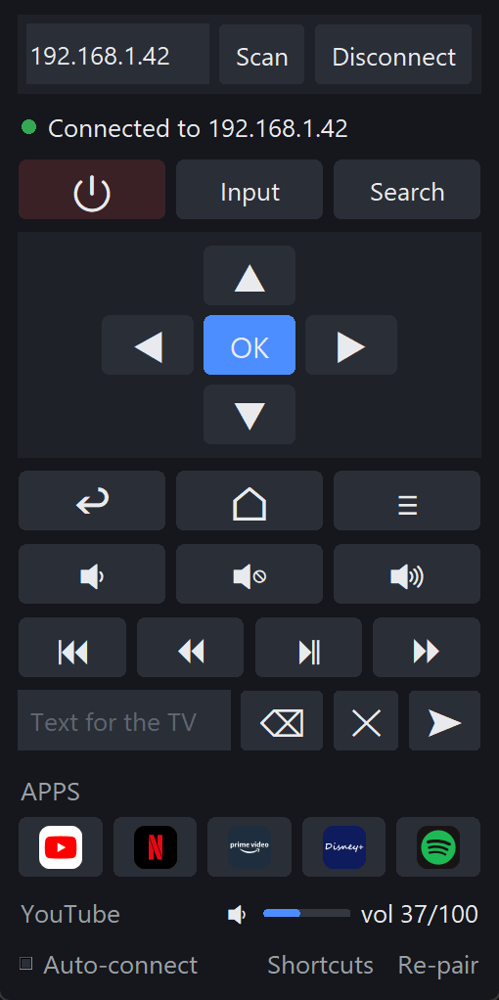

# Google TV Remote for Windows

A desktop remote control for Google TV / Android TV devices (Chromecast with
Google TV, Sony/TCL/Hisense Android TVs, NVIDIA Shield, ...).

It speaks the same **Android TV Remote Service v2** protocol the official
Google TV mobile app uses, so nothing has to be installed on the TV: turn it
on and pair once.

<p align="center">
  
</p>

## Features

* **Keyboard first.** Drive the TV from your keyboard: arrows and Enter for
  the D-pad, Backspace for Back, Space for play/pause, `+`/`-`/`M` for volume.
  Put the cursor in any text box on the TV and *just type* - every keystroke
  lands on the TV, Backspace deletes, Enter submits. This is the best way to
  use it; see [Keyboard control](#keyboard-control).
* **The whole remote**: power, D-pad, Back / Home / Menu, volume and mute,
  media keys with auto-repeat, and an **Input** menu that switches HDMI / AV /
  tuner directly on TCL sets (key codes for other makers, or your own input
  ids).
* **One-tap app buttons** with the apps' own logos for YouTube, Netflix,
  Prime Video, Disney+ and Spotify - replace them with any app you like.
* **Live status from the TV**: volume, power state, foreground app, and
  whether a text box is waiting for input.
* **Zero setup on the TV**: find it with a network scan, pair once with the
  on-screen code, and the app auto-connects and auto-reconnects from then on.
* **One file**: a standalone `.exe` with no runtime to install; from source
  it needs only Python and `cryptography` - the protocol (TLS, protobuf,
  mDNS) is implemented on the standard library.
* Resizable, HiDPI-aware interface; works with multiple TVs.

## Install

**Standalone .exe (no Python needed):** download `GoogleTVRemote.exe` from
the [Releases](../../releases) page and put it anywhere. Pin it to the
taskbar, or drop a shortcut into `shell:startup` to have it ready at login.

**From source:**

* Windows 10/11 and Python 3.10+ with `tkinter` (included in the python.org installer)
* `pip install -r requirements.txt` (the only dependency is `cryptography`)

Then double-click **`GoogleTVRemote.pyw`**, or run `python -m gtvremote`.
`pip install .` also works and installs a `gtvremote` command.

## First use

1. Press **Scan** to find TVs on your network, or type the TV's IP address
   (on the TV: *Settings → Network & Internet → your network*).
2. Press **Connect**. The first time, the app offers to pair.
3. A **6-digit code** appears on the TV. Type it into the app.

After the first successful pairing the app **auto-connects to that TV on
startup**, so it is ready the moment it opens. Turn this off with the
**Auto-connect** checkbox at the bottom.

Pairing is remembered: the app keeps a client certificate in
`%APPDATA%\GoogleTVRemote\`, and the TV recognises it from then on. Use
**Re-pair** (bottom right) if the TV ever forgets this remote.

## Keyboard control

The remote is at its best from the keyboard: keep the window focused and
you never need the mouse.

| Key | Action on the TV |
|---|---|
| `←` `↑` `→` `↓` | D-pad |
| `Enter` | OK (select) |
| `Backspace` or `Esc` | Back |
| `Home` | Home screen |
| `Space` | Play / Pause |
| `+` / `-` | Volume up / down |
| `M` | Mute |
| `Ctrl` `+` / `Ctrl` `-` / `Ctrl` `0` | Resize the interface / reset |

The same list is a click away in the app: press **Shortcuts** at the bottom
of the window.

**Typing on the TV.** Whenever the TV has a text box focused (a search box,
a login form...), the status bar says *TV text box active - just type*:

| Key | Action |
|---|---|
| any character | typed into the TV's text box, live |
| `Backspace` | deletes the last character |
| `Enter` | submits (e.g. runs the search) |
| arrows | still move the D-pad, so you can pick a suggestion |

Shortcuts apply while the window is focused and the cursor is not inside
one of the app's own boxes (the IP box or the text box); pressing Connect
or clicking the window background moves focus out of them.

## Controls

The on-screen buttons cover everything the keyboard does, plus:

| | |
|---|---|
| Input | Opens a menu of the TV's inputs. On TCL sets these switch directly (HDMI 1-4, AV, tuner); other makers get the input-picker / HDMI key codes, which only some TVs honour. See *Settings* to add your own |
| Text box + ➤ | Sends a whole line to the TV's text box in one go; ⌫ deletes the last character on the TV and ✕ clears the field |
| Apps | One-tap icons for YouTube, Netflix, Prime Video, Disney+ and Spotify (hover for the name) |

Arrow and volume buttons auto-repeat when held. The status bar shows the
live volume, power state and foreground app, all pushed by the TV.

### Settings

`%APPDATA%\GoogleTVRemote\settings.json` remembers the last TV, the window
size and position, and the UI scale. The app buttons can be replaced there:

```json
"apps": [
  {"name": "Plex", "link": "plex://"},
  {"name": "Twitch", "link": "tv.twitch.android.app"}
]
```

A link without a scheme is treated as a package name and opened through
`market://launch?id=...`, which launches exactly that app. Plain `https://`
links tend to make Android show an "Open with" chooser instead. Apps the
remote knows get their icon; any other app shows a tile with its initial.

The Input menu can be replaced the same way:

```json
"inputs": [
  {"name": "HDMI 1", "link": "com.tcl.tvinput/.passthroughinput.TvPassThroughService/HW1413744128"},
  {"name": "Input picker", "key": "KEYCODE_TV_INPUT"}
]
```

A `link` is a TV-input id (or a full `content://android.media.tv/passthrough/...`
URI); viewing it makes the TV app tune to that input, which is how the
remote switches inputs on TCL sets. Ids are vendor specific - with ADB
enabled, `adb shell dumpsys tv_input` lists them, or watch
`adb logcat | grep sourceName` while switching inputs with the TV's own
remote. A `key` entry sends an Android key code instead.

## Command line

```
python -m gtvremote --scan              # list TVs on the network
python -m gtvremote --pair 192.168.1.42 # pair from a terminal
```

## Using it as a library

```python
from gtvremote import RemoteClient, keycodes

tv = RemoteClient("192.168.1.42")
tv.start()
tv.wait_until_connected()
tv.send_key(keycodes.KEYCODE_DPAD_DOWN)
tv.launch_app("https://www.youtube.com")
tv.stop()
```

## How it works

The TV exposes two TLS ports. Both carry protobuf messages framed with a
varint length prefix.

* **6467 - pairing.** The client connects with a self-signed certificate and
  negotiates a hexadecimal 6-symbol code. The code's last two bytes are hashed
  together with the modulus and exponent of *both* certificates
  (`SHA-256(client_n ‖ client_e ‖ server_n ‖ server_e ‖ nonce)`); the first
  byte of the code is a checksum that must equal the first byte of that digest.
  Sending the digest back proves the user can see the TV screen.
* **6466 - control.** The TV drives the handshake: it sends `RemoteConfigure`,
  the client answers with its device info, then `RemoteSetActive` is echoed
  back. The TV pings every ~5 s and the client must respond or be dropped.
  Key presses are `RemoteKeyInject` messages carrying an Android key code.
  Text editing goes through `RemoteImeBatchEdit`, which replaces a character
  range of the focused field; it must echo the counters the TV announced
  when the field gained focus, and the TV reports the field's new contents
  after every edit.

`gtvremote/protobuf_lite.py` is a ~150-line protobuf implementation covering
just the wire types this protocol uses, so the app has no protobuf dependency.
The `.proto` files in `proto/` document the message layout and are the source
for the generated `keycodes.py`.

## Project layout

| Path | |
|---|---|
| `gtvremote/protobuf_lite.py` | protobuf encode/decode + stream framing |
| `gtvremote/messages.py` | pairing and remote message builders/parsers |
| `gtvremote/certs.py` | client certificate, TLS setup |
| `gtvremote/pairing.py` | pairing handshake (port 6467) |
| `gtvremote/remote.py` | control session with auto-reconnect (port 6466) |
| `gtvremote/discovery.py` | mDNS scan for `_androidtvremote2._tcp` |
| `gtvremote/config.py` | settings in `%APPDATA%\GoogleTVRemote` |
| `gtvremote/inputs.py` | input switching: per-vendor passthrough links and key codes |
| `gtvremote/keycodes.py` | Android key codes, generated from the proto |
| `gtvremote/ui/` | tkinter interface: `theme.py`, `widgets.py`, `icons.py`, `window.py` |
| `gtvremote/assets/icons/` | the app logos as PNGs at every size, rendered by `tools/render_icons.py` |
| `proto/` | the protocol's `.proto` files, for reference and the tests |
| `tests/` | unit tests, a mock TV, and the protobufjs cross-check |
| `tools/` | `gen_keycodes.py`, `render_icons.py` (+ the `icons/*.svg` glyphs), `screenshot_ui.py` |

## Development

```
pip install -e ".[build,dev]"
python -m unittest -v            # protocol vs. a mock TV, UI, parsers, discovery
python tools/gen_keycodes.py     # regenerate keycodes.py after editing the proto
python tools/render_icons.py     # re-render the app logos (tools/icons/*.svg -> assets/icons)
build_exe.bat                    # dist\GoogleTVRemote.exe
```

The Python protobuf encoder is cross-checked against the real
[protobufjs](https://github.com/protobufjs/protobuf.js) library and the
official `.proto` files (needs Node.js):

```
cd tests && npm ci && cd ..
python tests/make_cases.py       # encode messages with the Python encoder
node tests/verify_encoding.js    # decode them with protobufjs and compare
node tests/make_fixtures.js      # regenerate the TV-side messages the mock TV replays
```

CI runs all of this on every push. Pushing a `v*` tag builds the `.exe` and
attaches it to a GitHub release.

## Troubleshooting

**"Cannot reach ..."** - the TV is off, asleep, or on another network/VLAN.
Many TVs stop answering in deep standby; enable *Networked standby* /
*Remote start* in the TV's power settings.

**The connection drops now and then** - TVs and Wi-Fi hops reset an idle
session from time to time. The app reconnects within half a second (a key
pressed in that moment is reported as "Not connected"; press it again).
Every connect and drop, with its cause, is written to
`%APPDATA%\GoogleTVRemote\remote.log` - look there if the link keeps going.

**"The TV does not recognise this remote"** - the TV forgot the pairing (a
factory reset, or removal from *Settings → Remotes & Accessories*). Press
**Re-pair**.

**Scan finds nothing** - mDNS is often blocked on guest or corporate Wi-Fi,
and by some VPNs. Enter the IP address manually instead.

**Nothing happens when a key is pressed** - check the status dot is green.
Power is a toggle on most devices; some only wake over HDMI-CEC.

**"No text field is focused" / "The TV did not accept the edit"** - text is
delivered to whichever text field the TV has focused. Select the field
first (the on-screen keyboard or a blinking cursor shows it is active), then
type; the TV confirms every edit it applies, and the app reports when it
does not.

**Input does nothing** - on non-TCL sets the menu sends key codes, which
many makers ignore (and streaming dongles have no inputs). Add your TV's
input ids to `settings.json` as described under *Settings*.

## License

[MIT](LICENSE)

The app logos on the shortcut buttons are trademarks of their respective
owners and appear only to identify the apps the buttons open. The glyphs are
the CC0 files published by [Simple Icons](https://simpleicons.org); Disney+
has no such glyph, so its tile shows the name in a script face instead.
